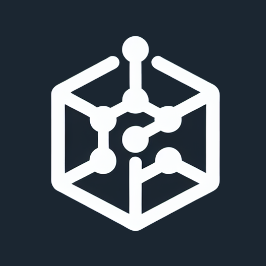

---
_layout: landing
title: Ecco Sneaks&Data Services suite
tagline: Set of scalable open-source solutions for building data platform
---

    <h1 style="margin-bottom: 150px;">Ecco Data platform</h1>
    

         

            
            

            <a class="btn btn-lg btn-primary" href="/arcane-docs">Arcane</a>
            
Stream-based horizontally scalable data ingestion platform

            

        

         

            
            

            <a class="btn btn-coming-soon" href="/beast-docs">Beast</a>
            
Kubernetes workload manager for Spark based on Akka.NET

            

        

         

            
            

            <a class="btn btn-coming-soon" href="/crystal-docs">Crystal</a>
            
High-performance runner for containerized machine learning algorithms.

            

        

         

            
            

            <a class="btn btn-coming-soon" href="/boxer-docs">Boxer</a>
            
Authorization API with Signature Based Authentication Provider

            

        

    

<h1>Simplicity</h1> 

Simple deployment using Helm charts and schema-bound Kubernets custom resouces with a declarative configuration.
 

<h1>Scalability</h1>

All services are designed to be horizontally scalable and can be easily deployed in a Kubernetes cluster.

<h1>Cloud-native</h1>

Managed by schema-based Kubernetes custom resources and Helm charts for easy integration with any cloud-native configuration management tool.

<h1>Cost efficiency</h1>

Price efficiency is a key factor the services design. They can be used with any cloud provider with on-demand and spot instances.

